# watch项目
## 一，项目介绍
- 该项目通过紧贴皮肤来测量身体的数据指标
- 可以测量心率，血压，血氧
- 此外还集成了计步检测、气压海拔测量、
指南针、环境温湿度等功能

## 二，主控芯片介绍
### 1.esp32
- 该项目采用的是esp32芯片。
- 该芯片是集成了2.4GHZ wi-fi 和 bluetooth 5 (LE)的mcu芯片
- ESP32-S3 搭载 Xtensa® 32 位 LX7 双核处理器，主频高达 240 MHz，内置 512 KB SRAM (TCM)，具有 45 个可编程GPIO 管脚和丰富的通信接口
- ESP32-S3 支持更
大容量的高速 Octal SPI flash 和片外 RAM，支持用户配置数据缓存与指令缓存。
#### 1.1 wifi和蓝牙
- ESP32-S3 集成 2.4 GHz Wi-Fi (802.11 b/g/n)，支持 40 MHz 带宽
- 其低功耗蓝牙子系统支持 Bluetooth 5 (LE) 和 Bluetooth Mesh，可通过 Coded PHY 与广播扩展实现远距离通信
- 它还支持 2 Mbps PHY，用于提高传输速度和数据吞吐量
#### 1.2 io接口
- ESP32-S3 拥有 45 个可编程 GPIO 以及 SPI、I2S、I2C、PWM、RMT、ADC、UART、SD/MMC 主机控制器和 TWAITM 控制器等常用外设接口。

## 三，项目基本要求
- 通过蓝牙连接手机，和手机进行数据交互
-  LCD 触摸屏幕的驱动，以及界面设计：该项目的屏幕采用一块 1.69 寸的 LCD 屏幕，分辨率为 240*280。显示驱动 IC 为 ST7789V,其通信接口为 SPI。触摸 IC 为 CST816T，其通信接口为 IIC。界面设计采用 LVGL 对屏幕进行
开发。
-  计步功能：MPU6050 传感器以及计步算法实现计步功能
-  健康数据检测：使用惊帆科技研发的多光谱生理数据测量模块（JFH142 ）
-  指南针：通过一个三种地磁传感器 QMC5883L，能让罗盘航向精度精确到 1°~2。的通信接口为 IIC
-  气压海拔检测：BMP280 是一款低功耗数字复合传感器，
通信接口是 IIC
-  环境温湿度：AHT20
-  实时时间显示：采用esp32芯片的rtc时钟
## 四，软件环境搭建
- 在vsc中搜索ESP 下载ESP-IDF
- 然后使用ctrl+shiift+p，输入Open ESP-IDF Installation Manager 下载并打开管理器
- 或者找ESP WELCOM （这个我没用过）
- 进入界面 选第一个简易安装 让它给我们装
- 在 Visual Studio Code 中，进入 查看 > 命令面板，输入 select current esp-idf version，然后选择 ESP-IDF：选择当前 ESP-IDF 版本。将显示可用的 ESP-IDF 安装列表，请选择要用于当前 ESP-IDF 项目的版本。所选配置将保存为 idf.currentSetup（即所选安装对应的 setup 标识），扩展会为当前项目配置环境变量并保存为工作区文件夹状态。您可以通过运行 ESP-IDF：诊断命令 来查看配置：进入 查看 > 命令面板，输入 doctor command，然后选择 ESP-IDF：诊断命令。如果未检测到已安装的 ESP-IDF，请在设置中配置 idf.eimIdfJsonPath，将其指向本机的 eim_idf.json 文件。
- 
- 
- ESP-IDF 扩展在 VS Code 底部窗口的状态栏中提供了一系列命令图标，将鼠标悬停在图标上时，会看到可执行的命令。

以下步骤展示了这些图标的常见用例：

1. 按 F1 并输入 **ESP-IDF：新建项目**，从 ESP-IDF 示例创建新项目。选择 ESP-IDF 并选择示例以创建新项目。

2. 创建好新项目并在 VS Code 中打开后，点击状态栏图标 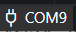 设置设备的串口。也可以按 <kbd>F1</kbd> 输入 **ESP-IDF：选择要使用的端口**，选择设备连接的串口。

3. 点击状态栏图标 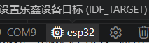 选择使用的芯片设备（如 esp32、esp32s2 等），或按 <kbd>F1</kbd> 输入 **ESP-IDF：设置乐鑫设备目标** 命令。

4. 接下来，通过点击状态栏图标 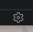 或按 <kbd>F1</kbd> 输入 **ESP-IDF：SDK 配置编辑器** 命令（快捷键：<kbd>CTRL</kbd> <kbd>E</kbd> <kbd>G</kbd>），修改 ESP-IDF 项目设置。完成所有更改后，点击 `Save` 并关闭此窗口。可以在菜单栏中的`查看` -> `输出`中选择下拉列表里的 `ESP-IDF` 来查看输出信息。

5. （可选）**ESP-IDF：运行 idf.py reconfigure 任务** 命令生成 `compile_commands.json` 文件，以便启用语言支持。也可以按照 [C/C++ 配置](https://docs.espressif.com/projects/vscode-esp-idf-extension/zh_CN/latest/configureproject.html#c-and-c-code-navigation-and-syntax-highlight) 文档中的说明来配置 `.vscode/c_cpp_properties.json`。

6. 请自行对代码进行必要修改。完成项目后，点击状态栏图标 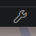 或按 <kbd>F1</kbd> 输入 **ESP-IDF：构建项目** 来构建项目。

7. 点击状态栏图标  或按 <kbd>F1</kbd> 输入 **ESP-IDF：烧录项目**，依据使用的接口类型，在命令面板中选择 `UART`、`DFU` 或 `JTAG`，将应用程序烧录到设备上。

8. 点击状态栏图标 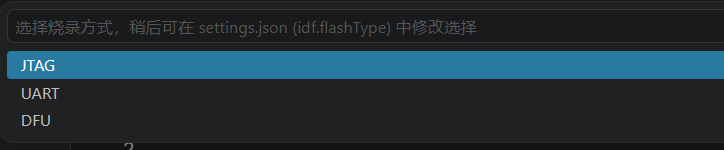 或按 <kbd>F1</kbd> 输入 **ESP-IDF：选择烧录方式**，从 `UART`、`DFU` 或 `JTAG` 中选择想要更改的烧录方式。也可以直接使用命令 **ESP-IDF：通过 UART 接口烧录项目**、**通过 JTAG 接口烧录项目** 或 **ESP-IDF：通过 DFU 接口烧录项目**。

9. 点击状态栏图标  或按 <kbd>F1</kbd> 输入 **ESP-IDF：监视设备** 启动监视器，在 VS Code 终端中记录设备活动。

10. 根据 ESP-IDF 文档中的要求来配置驱动程序，详情请参考[配置 JTAG 接口](https://docs.espressif.com/projects/esp-idf/zh_CN/latest/esp32/api-guides/jtag-debugging/configure-ft2232h-jtag.html)。

11. 在调试设备之前，如果您使用的是已连接的 ESP-IDF 开发板，OpenOCD 配置将根据您连接的开发板自动选择，包括 USB 位置（如果可用）（需要 OpenOCD 版本 v0.12.0-esp32-20240821 或更高）。否则，您可以按 <kbd>F1</kbd> 输入 **ESP-IDF：选择 OpenOCD 开发板配置** 手动选择设备的 OpenOCD 开发板配置文件。点击状态栏图标 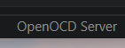 或按 <kbd>F1</kbd> 输入 **ESP-IDF：OpenOCD 管理器** 命令来测试连接。可以在菜单栏中的`查看` -> `输出`里选择下拉列表中的 `ESP-IDF` 来查看输出信息。

    > **注意：** 可以使用 **ESP-IDF：OpenOCD 管理器** 命令或者点击 VS Code 状态栏中的 `OpenOCD Server (Running | Stopped)` 按钮来启动或停止 OpenOCD。

12. 如果您想启动调试会话，只需按 <kbd>F5</kbd>（确保项目已构建、烧录，并且 OpenOCD 正确连接以便调试器正常工作）。调试会话的输出可在菜单栏中选择`查看` -> `调试控制台`进行查看。

## 五，创建工程
### 1. 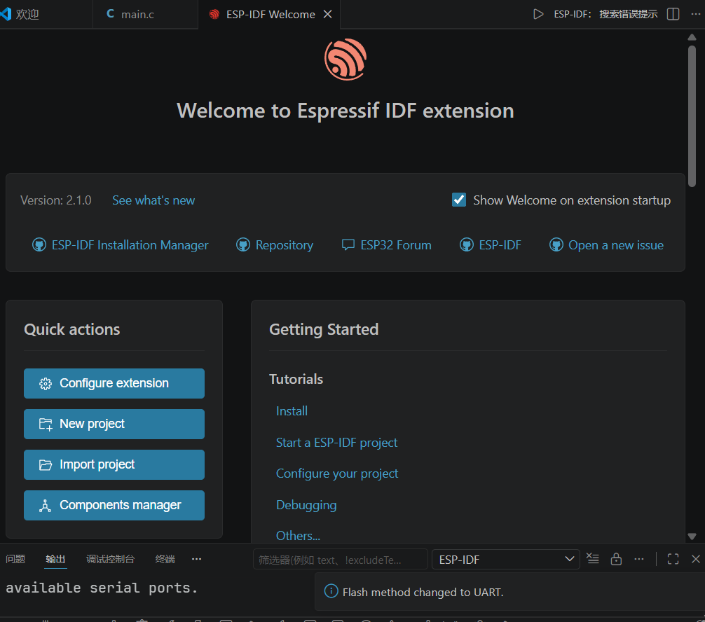在界面上找到new 点击
### 2. 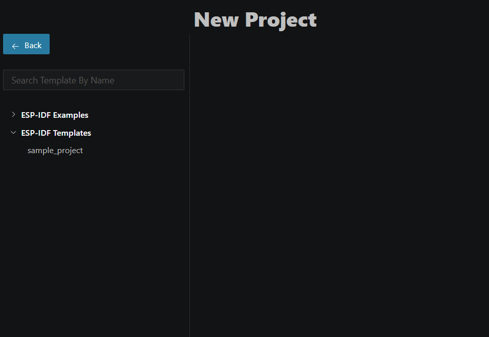
### 3. 选择sam那个模板然后一点一点跟就行了
### 4. 熟练之后可以选择其他工程，其他工程都是各种功能的示例代码，可供修改参考
### 5. 编译项目就是构建项目，点小扳手
### 6. 编译后有这样的提示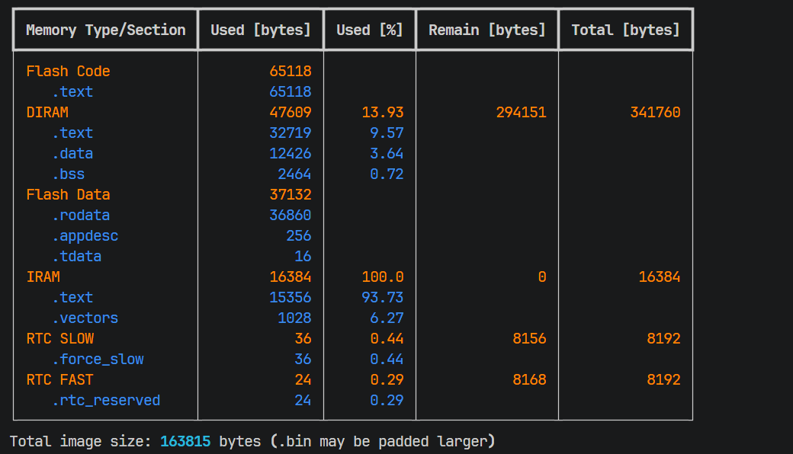
    1. Flash Code（闪存代码区）
    - Flash Code：存储程序代码的闪存区域
    - .text：编译后的机器码（程序执行指令）65118字节：代码占用约63.6KB
    2. DIRAM（数据IRAM）
    - DIRAM：数据IRAM（用于存储运行时数据）
    - .text：部分代码段（如初始化代码）
    - .data：已初始化的全局变量
    - .bss：未初始化的全局变量
    - 13.93%：使用率（341KB总容量中用了47KB）
    3. Flash Data（闪存数据区）
    -  Flash Data：存储常量数据的闪存区域
    -  .rodata：只读数据（如字符串、常量）
    -  .appdesc：应用描述信息
    -  .tdata：线程局部存储
    4. IRAM（指令IRAM）
    - IRAM：指令RAM（用于存储中断向量表和关键代码）
    - 100%：完全占用（16KB总容量）
    - .text：核心代码段
    - .vectors：中断向量表
    5. RTC SLOW（实时时钟慢速内存)
    - RTC SLOW：低功耗内存（用于存储配置）
    6. RTC FAST（实时时钟快速内存)
    - RTC FAST：快速内存（用于实时任务）
    7. 163815字节：编译生成的固件镜像大小（约160KB）

### 7.基础工程配置
 1. flash（闪存）设置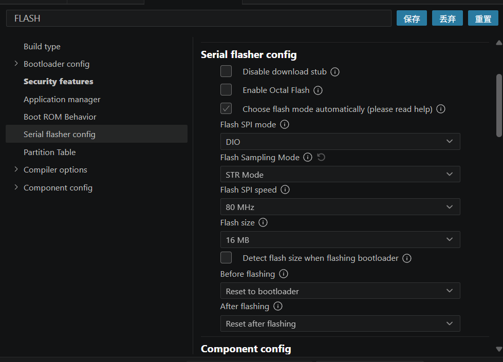
 2. 内存分区表：Partition设置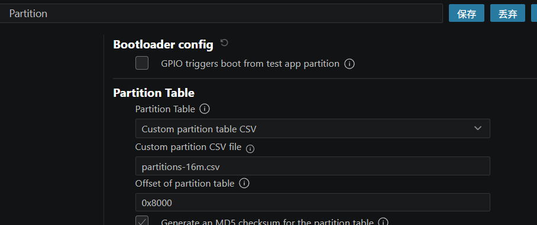
 3. PSRAM 设置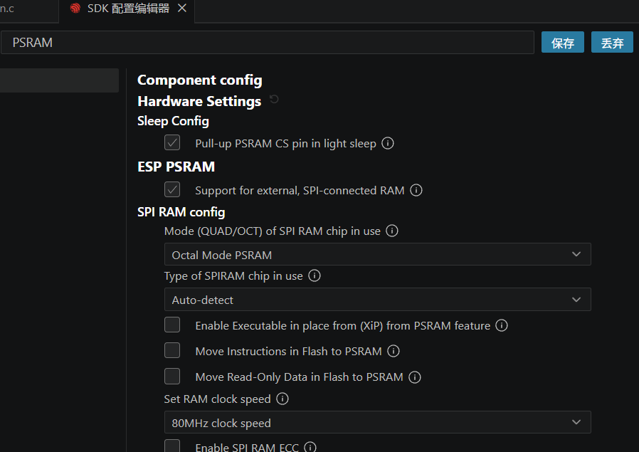
 4. CPU 时钟频率:CPU frequency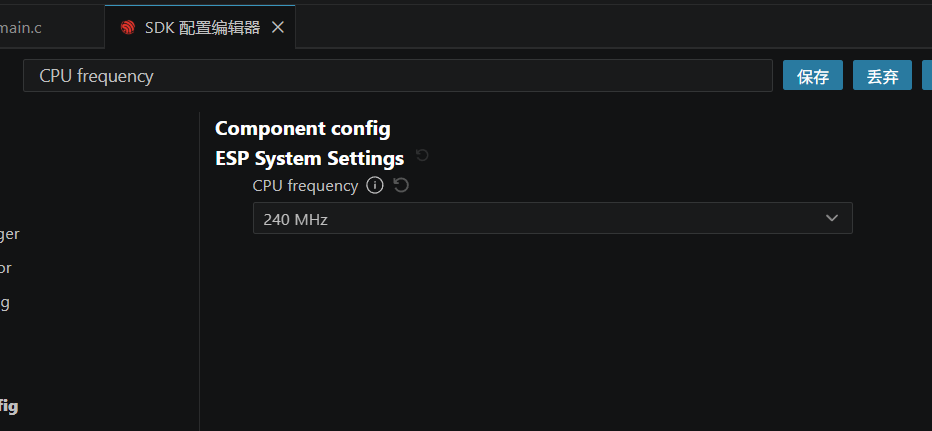
 5. FreeRTOS 时钟节拍频率 1s1000 次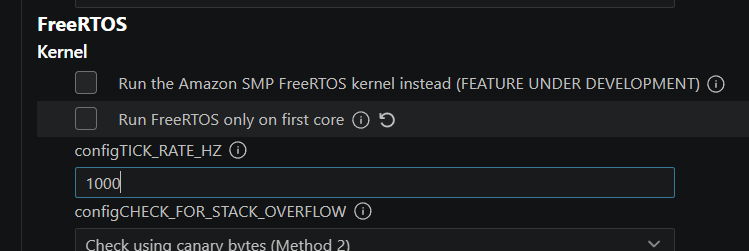
 6. 分区表设置：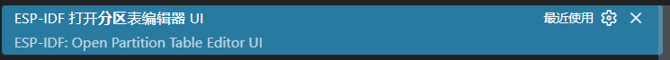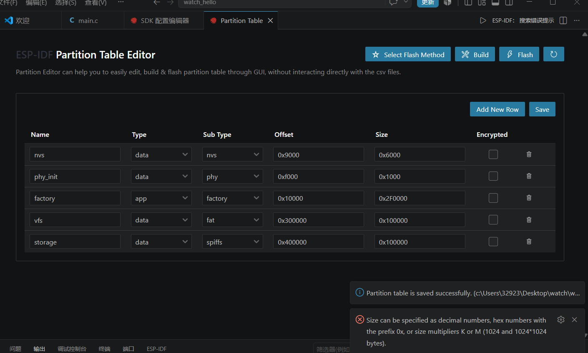
### 7. 工程框架
  创建一个 components 文件夹，components 文件夹主要用于存放第三方驱动库和开发者编写的驱动库，在 components 中创建 BSP 文件夹，在这个文件夹中存放我们的代码。除此之外，还需要创建一个 CMakeLists.txt 文件。其中 src_dirs 是我们的.c 文件名字,include_dirs 是我们的.h 文件.requires 是 esp 依赖的库，比如要使用 adc，就需要包含 esp_adc使用蓝牙就要包含 bt；idf_component_register 注册组件到构建系统的函数，后期会包含 LVGL的组件加上 REQUIRES lvgl；之后把选择串口下载，选择芯片 esp32s3，选择对应的串口就可以下载了
  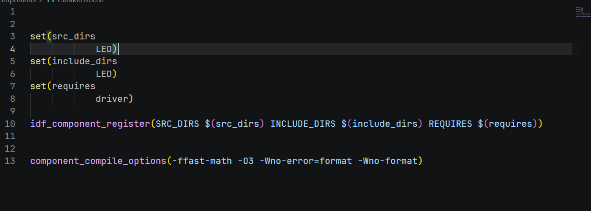
1. set(src_dirs LED)
作用：设置组件的源文件目录（src_dirs 是变量名）。
含义：组件的源代码文件位于 LED 目录下（例如 LED/main.c 等源文件）。
2. set(include_dirs LED)
作用：设置组件的头文件包含目录（include_dirs 是变量名）。
含义：组件的头文件（如 LED/led.h）位于 LED 目录，编译时会在此目录查找头文件。
3. set(requires driver)
作用：设置组件的依赖组件（requires 是变量名）。
含义：该组件（如 LED 组件）依赖 driver 组件（需先编译 driver 组件才能编译当前组件）。
4. idf_component_register(SRC_DIRS ${src_dirs} INCLUDE_DIRS${include_dirs} REQUIRES ${requires})
作用：通过 ESP-IDF 提供的宏 idf_component_register 注册组件，让构建系统识别该组件的配置。
参数解析：
SRC_DIRS ${src_dirs}：传入源文件目录（即 LED）。
INCLUDE_DIRS ${include_dirs}：传入包含目录（即 LED）。
REQUIRES ${requires}：传入依赖组件（即 driver）。
5. component_compile_options(-ffast-math -O3 -Wno-error=format -Wno-format)
作用：设置组件的编译选项（优化、警告控制等）。
选项解析：
-ffast-math：启用快速数学优化（牺牲部分精度，提升性能）。
-O3：最高优化级别（编译器会进行深度优化）。
-Wno-error=format：将“格式相关警告”降级为普通警告（避免因格式问题导致编译失败）。
-Wno-format：忽略格式相关的警告（如 printf 格式不匹配等）。
整体作用
这段代码是 ESP-IDF 项目中 LED 组件的 CMake 配置，用于：

告知构建系统组件的源文件、头文件位置；
声明组件依赖（需先编译 driver）；
配置编译优化和警告控制，提升性能或避免编译错误。
这种配置是 ESP-IDF 项目中组件化开发的核心语法，通过 CMake 宏定义组件的元数据，让 IDF 构建工具（idf.py）自动处理编译、链接等流程。

